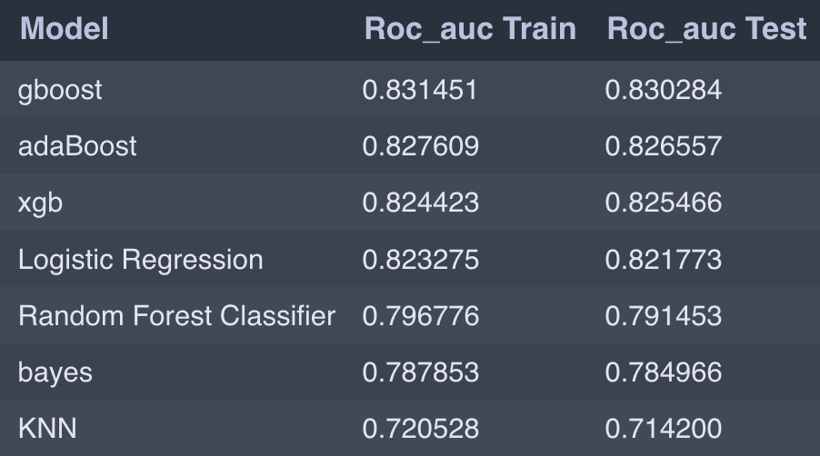
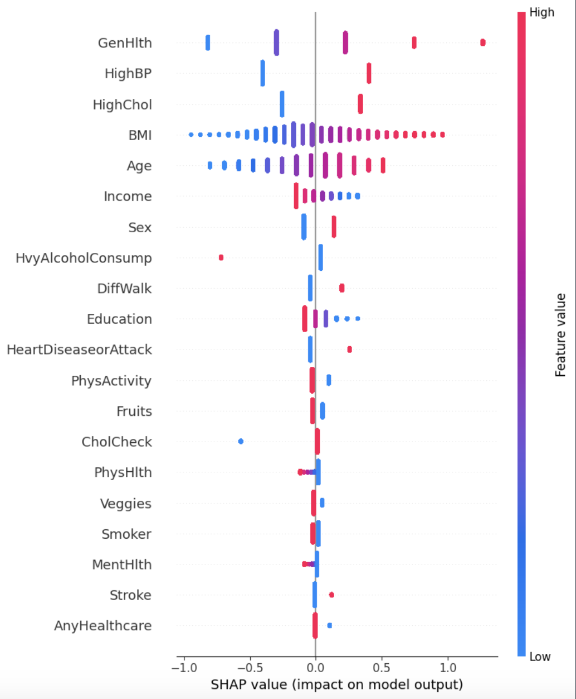

# Diabetes Prediction Project

This project was conducted as part of the Machine Learning course at Warsaw University of Technology.

## Goal
The primary goal of this project was to apply supervised learning techniques for classification. The business case involved creating a reliable model to assist medical centers in accurate diagnosis and predicting probabilities of type II diabetes.

## Source Dataset
The data was originally sourced from the Behavioral Risk Factor Surveillance System (BRFSS), an annual health-related telephone survey conducted by the Centers for Disease Control and Prevention (CDC). However, for the purpose of this project, we used a preprocessed version that can be found at [kaggle.com](https://www.kaggle.com/datasets/alexteboul/diabetes-health-indicators-dataset/data).

## Technologies Used
- Python
- Libraries: Pandas, NumPy, Scikit-learn, SHAP

## Scope of the Project
The project encompassed the following stages:
1. Exploratory Data Analysis (EDA): Understanding the dataset and identifying patterns.
2. Feature Engineering (FE): Transforming and creating new features to improve model performance.
3. Model Building: Employing various classification algorithms and hyperparameter tuning for optimal performance.
4. Model Interpretation: Utilizing SHAP library for interpreting model predictions and feature importance.

## Results
- Achieved high ROC-AUC scores, indicating the models' effectiveness in predicting probabilities of diabetes.
- Identified significant predictors for diabetes, including general health, age, BMI, blood pressure, cholesterol level, and income.

  
  
Figure 1: The ROC-AUC score results for different models on train set and on test set.

  
  
Figure 2: A SHAP summary plot presenting the most influential features from the dataset, i.e. the features that that have the most impact on the model's predicition of type II diabetes.

## Repository Contents
The repository contains the following key files and directories:
- `data/`: Directory containing the dataset files used in the project.
- `Diabetes_EDA.ipynb`, `Diabetes_FE.ipynb` and `Diabetes_final_models.ipynb`: Jupyter notebooks with code for data exploration, feature engineering, model building, and evaluation.
- `models/`: Directory containing the best saved models.
- `Diabetes Classification Report`: Report from the project in the form of a presentation.

## Authors
- Hubert Kowalski
- Mateusz Iwaniuk

